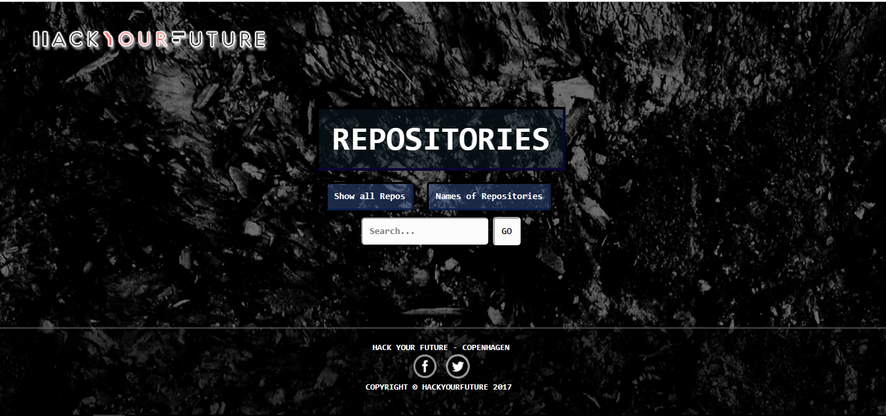

### Git Repositories

- This part of the homework shows you the all of the repositories available in Hack Your Future.
- With the help of this website, you can easily check specific information of the repository that you are looking for.
- Here, you can check the summary of all the repositories in one click. 
- You can also view all the repositories with its corresponding contributors or maybe just directly search a repository that you wnat to have access with.

### Here's how it looks : 

At the bottom part of the homepage, you can also access Hack Your Future's social media accounts for more information about the foundation and the latest updates about it by clicking the desired social media account.

# How to access it

- **You can go directly to this link to access the website.**

https://johbaguio.github.io/hyf-homework/javascript/javascript3/week1/Step2/index.html 

- After clicking one of the buttons in the homepage, it will automatically bring you to the specified information of that button and at the bottom of each page you can find a Home button which you can click to go back to the homepage.

## P S

- The website still needs to be improved.
*Still working on it :D*